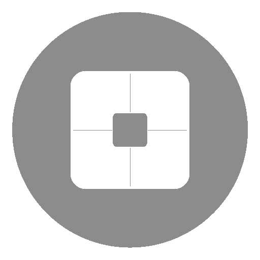

<h1 align="center">GjallarhornControl</h1>

A site to serve as fronted for Music and SFC in my <a>ChariotSanzzo</a> Discord Bot.

---

## About it

-   Created for be used in my personal RPG campaings, it's a simple, yet super useful way of controling the musics and SFXs playing in my discord calls, communicating with my discord bots [ChariotSanzzo](https://discord.com/oauth2/authorize?client_id=1070103829934260344&permissions=8&integration_type=0&scope=bot+applications.commands) and [Gjallarhorn](https://discord.com/oauth2/authorize?client_id=1273070668451418122&permissions=3149056&integration_type=0&scope=bot) ([Their Github Repo](https://github.com/IttoSanzzo/ChariotSanzzo)).
-   It was done using HTML, CSS, Javascript, node, npm and the Notion API.

## How to Use

-   keep in mind that you have to be in a Voice Channel in a server which contains ChariotSanzzo, and Gjallarhorn if needed, and they need to have the permissions for the said Voice Channel.
-   Acess it at [GjallarhornControl.com](http://189.13.111.87:11760).
-   Select if you want to control Gjallarhorn or ChariotSanzzo.
-   Give your user ID (not your user name).
-   Optionally, you can provide the ID of one Text Channel in the server, to receive the messages of usage from the bot selected.
-   Once logged, it will then connect to the bot, and load our Music and SFX database for the appropriate bot.

-   Hovering over a play button will show it's description.
-   Pressing it will make send the bot a priority play command, which will then start playing the said track immediately.

## Seach Bar

-   Writing in the search bar will filter all track buttons, showing only the ones that correspond to the query.
-   Clearing the bar returns all buttons.
-   Pressing enter or the  right play button while there's a query in the search bar, causes it to send the given query to the bot as a play request, and clears the search bar.
-   Pressing the  cancel button, also clears the search bar.

## Action Buttons

Some of the Buttons are available only for ChariotSanzzo.

 : Switches between the "paused" and "playing" states.

 :
Plays the previous track in the queue, if there's one.

 : Plays the previous track in the queue, if there's one.

 : Switches the loop state of the queue between "None", "Same Track" and "Full Queue".

 : Shuffles the queue, and then plays the new first track of it.

 : Stops the track, and cleans it's queue.

 : Stops the track, cleans it's queue, and makes the bot exit the Voice Channel.
